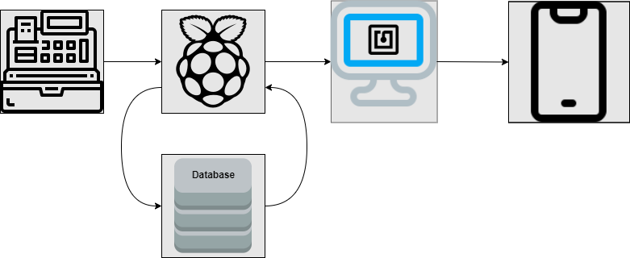

Digital Receipt Reader - 2021
===========================================

<h2>Description</h2>

We are proposing an NFC powered digital receipt system that will transfer receipts from a store’s point of sale (POS) system to a customer’s mobile app at checkout. The system will consist of two Raspberry Pis, an NFC reader, and a mobile app to store receipts.

<h2>Group Members</h2>

<h3>Luke Lengel</h3>

* Project Team Leader

<h3>Seth Hancock</h3>

* Integration Team Lead

<h3>Sam Butler</h3>

* Software Lead

<h3>Miah Hale</h3>

* Hardware Lead

